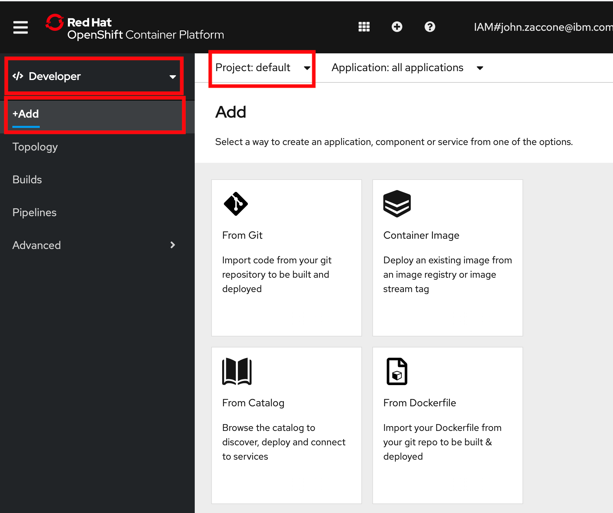

# Lab - Working with S2I and Templates

## Overview

S2I is a tool deployed in OpenShift that provides a repeatable method to generate application images from source/binary code. Templates provide a parameterized set of objects that can be processed by OpenShift.

In this lab you'll use these capabilities to deploy a small legacy Java EE app to OpenShift in a multi-user OpenShift environment

### Step 1: Logon into the OpenShift Web Console and to the OpenShift CLI

Follow the [setup steps](../../pre-work/server-openshift.md) to gain access to the OpenShift Web Console And CLI

### Step 2: Clone the WebSphere Liberty S2I image source, create a Docker image,  and push it to the OpenShift internal registry

2.1 Clone the  the WebSphere Liberty S2I image source by issuing the following commands in the terminal window you just used to login via the CLI

  ```
   git clone https://github.com/IBMAppModernization/s2i-liberty-javaee7.git
   cd s2i-liberty-javaee7
  ```

2.2 Get the hostname of your OpenShift internal registry so you can push images to it

  ```
   export INTERNAL_REG_HOST=`oc get route default-route --template='{{ .spec.host }}' -n openshift-image-registry`
  ```

2.4 Build the S2I Liberty image and tag it appropriately for the internal registry

  ```
   docker build -t $INTERNAL_REG_HOST/`oc project -q`/s2i-liberty-javaee7:1.0 .
  ```

2.5 Login to the internal registry

  ```
   docker login -u `oc whoami` -p `oc whoami -t` $INTERNAL_REG_HOST
  ```

2.6 Push the S2I Liberty image to the internal registry

  ```
    docker push $INTERNAL_REG_HOST/`oc project -q`/s2i-liberty-javaee7:1.0
  ```

### Step 3: Install MariaDB from the OpenShift template catalog

3.1 In your Web console browser tab select the **Developer** role at the top left and make sure the **default** project is selected. Next, click **Add** on the lefthand menu.

   

3.2 Click on the **Database** tile

   


3.4 Click on  **MariaDB (Ephemeral)**

   

3.5 Click **Instantiate Template**

3.6 Enter the following values for the fields indicated below (leave remaining values at their default values)

| Field name | Value |
| ---------- | ----- |
| MariaDB Connection Username | `pbwadmin` |
| MariaDB Connection Password | `l1bertyR0cks` |
| MariaDB Database Name | `plantsdb`|

  When you're done the dialog should look like the following:

   

3.7 Click **Create**

3.8 Wait until the **Status** changes to **Ready** before continuing

   


### Step 4: Clone the Github repo that contains the code for the Plants by WebSphere app

4.1 From your terminal go back to your home directory

  ```
   cd ~
  ```

4.2  From the client terminal window clone the Git repo  with  the following commands

  ```
   git clone https://github.com/IBMAppModernization/app-modernization-plants-by-websphere-jee6.git
   cd app-modernization-plants-by-websphere-jee6
  ```

### Step 5: Install the Plants by WebSphere Liberty app using a template that utilizes S2I to build the app image   

5.1 Add the Plants by WebSphere Liberty app template to your OpenShift cluster

  ```
   oc create -f openshift/templates/s2i/pbw-liberty-template.yaml
  ```

5.2 In your Web console browser click on **+ Add** (top left)

   

5.3 Click the **From Catalog** tile

5.4 Select the **Other** category and then click  on the **Plants by WebSphere on Liberty** tile

   

5.5 Click **Instantiate Template**

5.6 Click **Create**

   

5.7 To see the progress of the build and subsequent deployment select  the **Administrator** role, then select **Workloads** and then **Pods**. The builder pod  should be running (Note: that name of the pod will have *build* as a suffix)

   

5.8 After a few minutes the build pod will terminate and the pod with the Plants by Websphere app will appear. Wait for that pod to show **Ready** before continuing. (Note: the name of the pod will not have *build* as a suffix).

   

5.9 In the navigation area on the left click **Networking** and then **Routes**. Click on the link in the **Location** column to launch the Plants By WebSphere app.

   

### Step 6: Test the Plants by WebSphere app

6.1 From the Plants by WebSphere app UI, click on the **HELP** link

   

6.2. Click on **Reset database** to populate the MariaDB database with data

6.3. Verify that browsing different sections of the online catalog shows product descriptions and images.

   

## Summary

With even small simple apps requiring multiple OpenShift objects, templates greatly simplify the process of distributing OpenShift apps. S2I allows you to reuse the same builder image for apps on the same app server, avoiding the effort of having to create unique images for each app.
