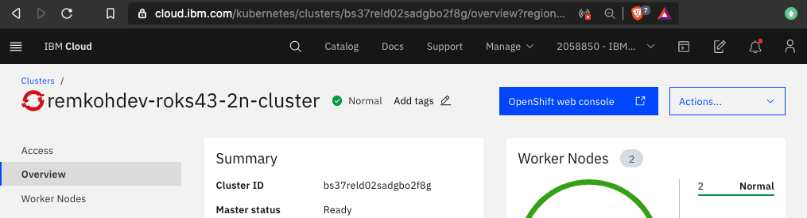
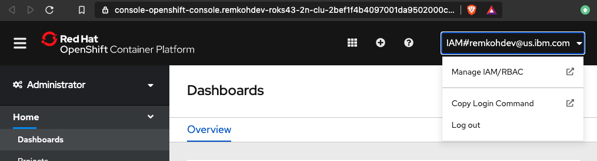
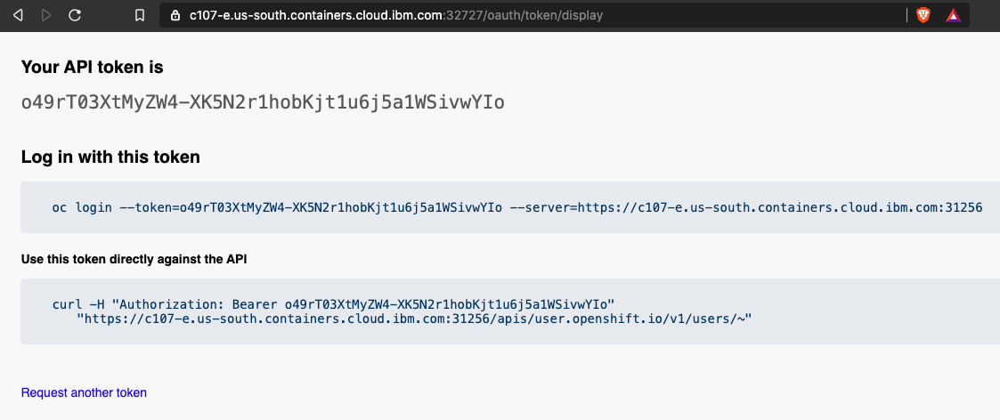
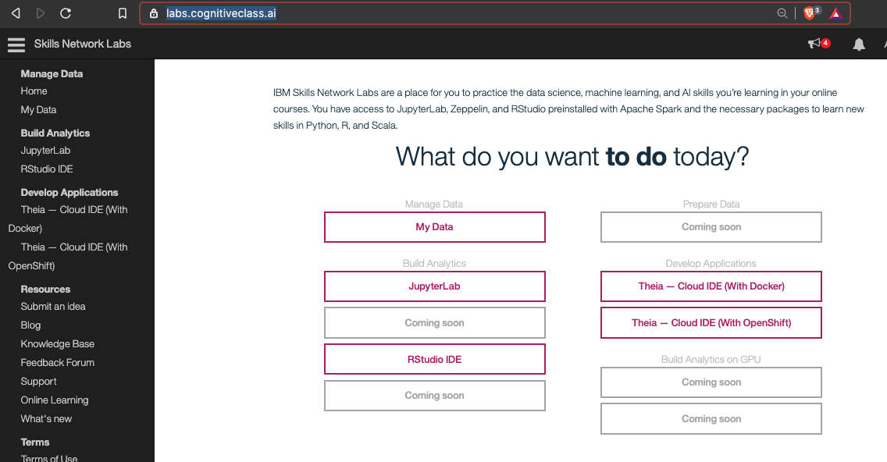

# Lab 1. Deploy your first application

Learn how to deploy an application to a Kubernetes cluster hosted within
the IBM Container Service.

## 0. Prerequisites

Make sure you have access to an OpenShift v4 cluster and log in to your cluster using the login command from the OpenShift web console.

1. Open your OpenShift Web Console from the IBM Cloud cluster overview page,



1. Copy Login Command from the OpenShift Web Console,



1. Copy the log in command and token,



1. Access the terminal, go to https://labs.cognitiveclass.ai/ and create an instance of the `Theia - Cloud IDE (With Docker)` option.



1. Open a new terminal,

1. Run the login command in your terminal,

```
oc login --token=o49rT03XtMyZW4-XK5N2r1hobKjt1u6j5a1WSivwYIo --server=https://c107-e.us-south.containers.cloud.ibm.com:31256
```


## 1. Deploy the guestbook application

In this part of the lab we will deploy an application called `guestbook`
that has already been built and uploaded to DockerHub under the name
`ibmcom/guestbook:v1`.

1. Start by running `guestbook`:

   ```shell
   kubectl create deployment guestbook --image=ibmcom/guestbook:v1
   ```

   This action will take a bit of time. To check the status of the running application,
   you can use `$ kubectl get pods`.

   You should see output similar to the following:

   ```console
   kubectl get pods
   ```

   Eventually, the status should show up as `Running`.

   ```console
   $ kubectl get pods
   NAME                          READY     STATUS              RESTARTS   AGE
   guestbook-59bd679fdc-bxdg7    1/1       Running             0          1m
   ```

   The end result of the run command is not just the pod containing our application containers,
   but a Deployment resource that manages the lifecycle of those pods.

1. Once the status reads `Running`, we need to expose that deployment as a
   service so we can access it through the IP of the worker nodes.
   The `guestbook` application listens on port 3000.  Run:

   ```console
   kubectl expose deployment guestbook --type="NodePort" --port=3000
   ```

1. To find the port used on that worker node, examine your new service:

   ```console
   $ kubectl get service guestbook
   NAME        TYPE       CLUSTER-IP     EXTERNAL-IP   PORT(S)          AGE
   guestbook   NodePort   10.10.10.253   <none>        3000:31208/TCP   1m
   ```

   We can see that our `<nodeport>` is `31208`. We can see in the output the port mapping from 3000 inside
   the pod exposed to the cluster on port 31208. This port in the 31000 range is automatically chosen,
   and could be different for you.

1. `guestbook` is now running on your cluster, and exposed to the internet. We need to find out where it is accessible.
   The worker nodes running in the container service get external IP addresses.
   Get the workers for your cluster and note one (any one) of the public IPs listed on the `<public-IP>` line. Replace `$CLUSTER_NAME` with your cluster name unless you have this environment variable set.

   ```console
   $ ibmcloud ks workers --cluster $CLUSTER_NAME
   OK
   ID                                                 Public IP        Private IP     Machine Type   State    Status   Zone    Version  
   kube-hou02-pa1e3ee39f549640aebea69a444f51fe55-w1   173.193.99.136   10.76.194.30   free           normal   Ready    hou02   1.5.6_1500*
   ```

   We can see that our `<public-IP>` is `173.193.99.136`.

1. Now that you have both the address and the port, you can now access the application in the web browser
   at `<public-IP>:<nodeport>`. In the example case this is `173.193.99.136:31208`.

Congratulations, you've now deployed an application to Kubernetes!

When you're all done, continue to the
[next lab of this course](../Lab2/README.md).
