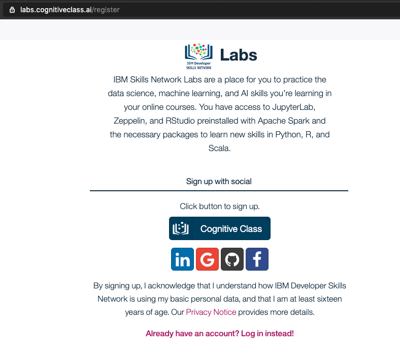
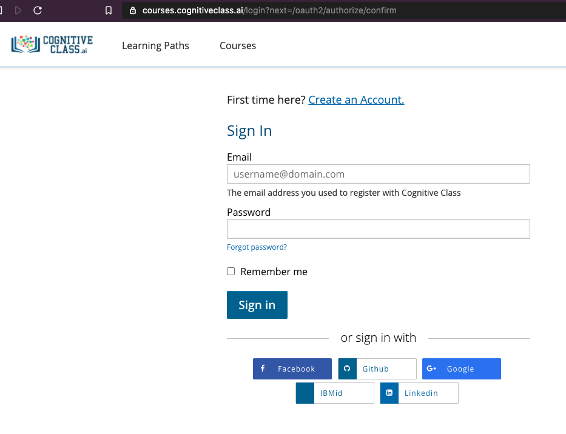
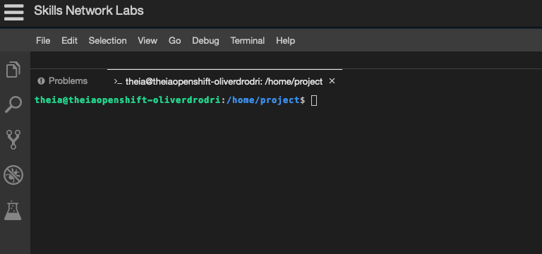

# CognitiveClass.ai

* If you have already registered your account, you can access the lab environment at **https://labs.cognitiveclass.ai/** and login.

* Navigate to https://labs.cognitiveclass.ai/register,

    

* Create a new account with your existing `IBM Id.` 

    

* Alternative, you can choose to use a Social login (LinkedIn, Google, Github or Facebook), or for using your email account click the `Cognitive Class` button,

* Click `Create an Account`,

* Fill in your Email, Full Name, Public Username and password, click on the check boxes next to the `Privacy Notice` and `Terms of Service` to accept them. Then click on `Create Account`.

* You will then be taken to a page with a list of sandbox environments. Click on the option for **Theia - Cloud IDE (With Docker)**

* Wait a few minutes while your environment is created.

    

* You will be taken to a blank editor page once your environment is ready.

*  What we really need is access to the terminal. Click on the `Terminal` tab near the top of the page and select **New Terminal**

    

*  You can then click and drag the top of the terminal section upwards to make the terminal section bigger.

    
