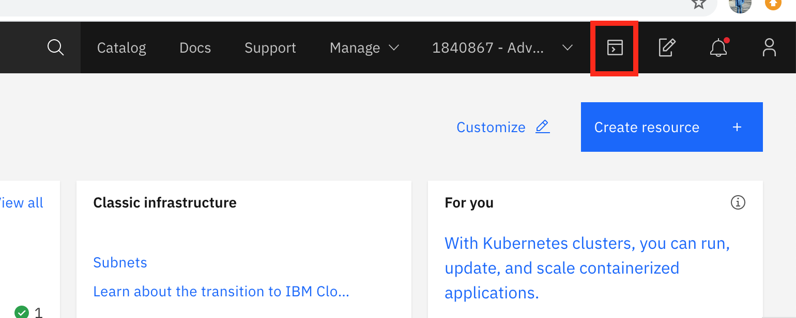
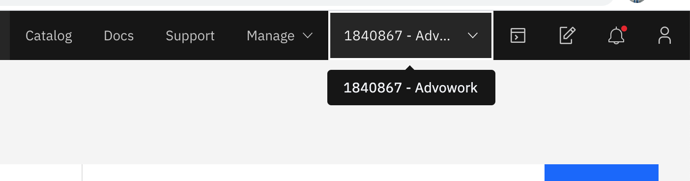
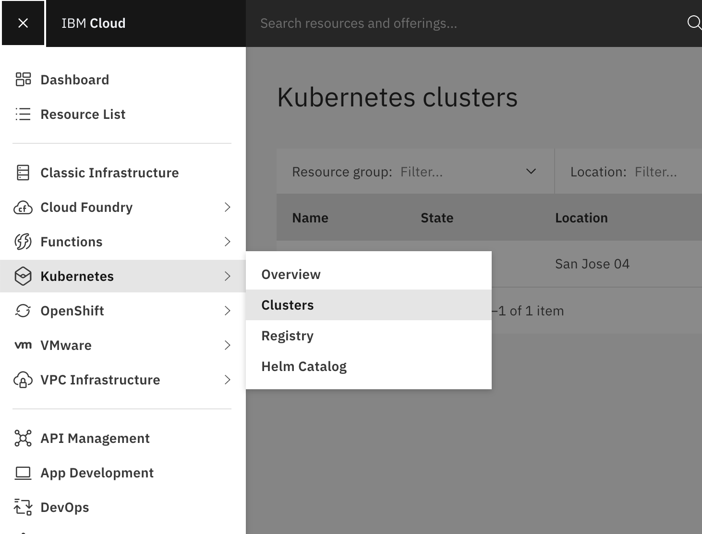
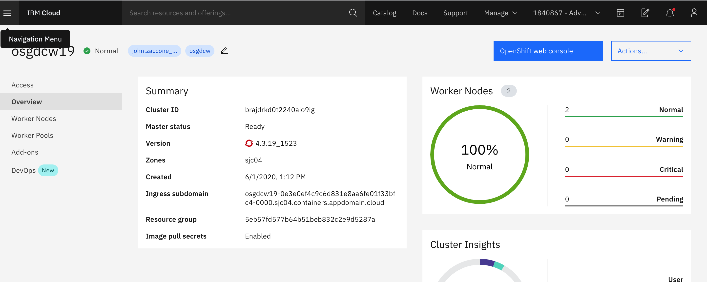
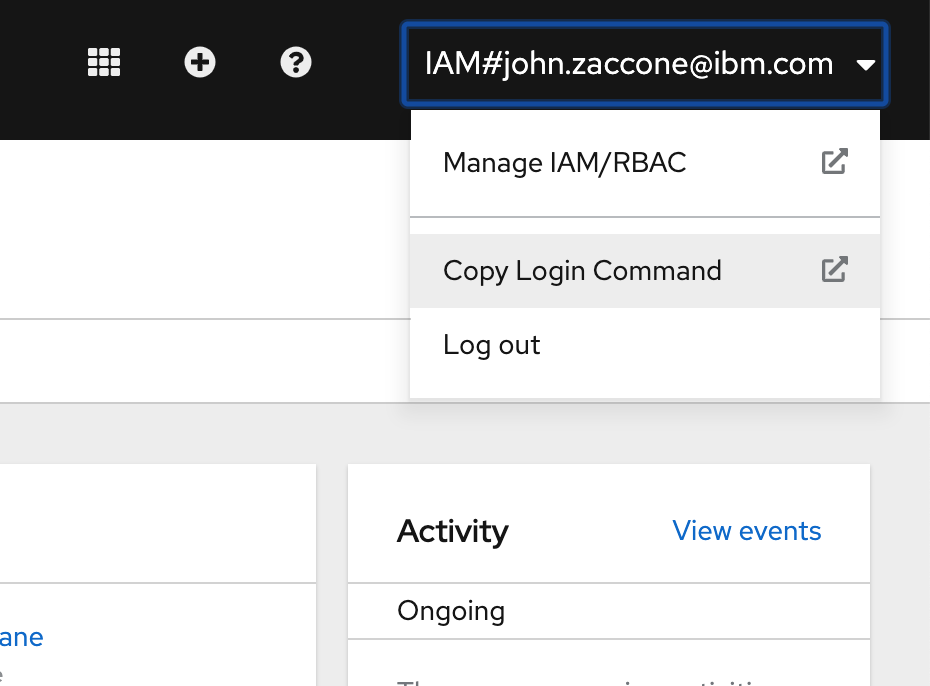

# Helm Lab 0

This section is broken up into the following steps:

1. [Access the Cloud Shell](#1-access-the-cloud-shell)
1. [Install Helm Version 3](#2-install-helm-version-3)
1. [Configure Kubectl](#3-configure-kubectl)
1. [Log into OpenShift](#4-log-into-openshift)

## 1. Access the Cloud Shell

From the [IBM Cloud Home Page](https://cloud.ibm.com), select the terminal icon in the upper lefthand menu.




## 2. Install Helm Version 3

Run the following commands to install Helm Version 3

```sh
wget https://get.helm.sh/helm-v3.2.0-linux-amd64.tar.gz
```

```sh
tar -zxvf helm-v3.2.0-linux-amd64.tar.gz
```

```sh
ls -al
```

```sh
echo 'export PATH=$HOME/linux-amd64:$PATH' > .bash_profile
```

```sh
source .bash_profile
```

```sh
helm version --short
```

The result is that you should have Helm Version 3 installed.
```sh
$ helm version --short
v3.2.0+ge11b7ce
```

## 3. Configure Kubectl

Run the `ibmcloud ks clusters` command to verify the terminal and setup for access to the cluster

```text
ibmcloud ks clusters
```

Configure the `kubectl` cli available within the terminal for access to your cluster.

```text
ibmcloud ks cluster config --cluster [cluster name]
```

Verify access to the Kubernetes API.

```text
kubectl get namespace
```

You should see output similar to the following, if so, then your're ready to continue.

```text
NAME              STATUS   AGE
default           Active   125m
ibm-cert-store    Active   121m
ibm-system        Active   124m
kube-node-lease   Active   125m
kube-public       Active   125m
kube-system       Active   125m
```

## 4. Log into OpenShift

Optionally, if you would like to use OpenShift for this lab, then you will need to authenticate with the OpenShift console before continuing.

From the [IBM Cloud Home Page](https://cloud.ibm.com), make sure you are in the IBM Cloud account where your cluster is located. Select from the dropdown menu in the upper right.



Next, find your clusters by navigating to **Kubernetes->Clusters** in the upper lefthand menu



Select your cluster to get to the cluster home page. Then, select the **OpenShift Web Console** Button



From the OpenShift console, in the upper righthand menu, select **Copy Login Command**



Follow the instructions including logging in using your IBM ID to get the command to login. Run the command in your IBM Cloud Shell environment

```console
oc login --token=... --server=...
```