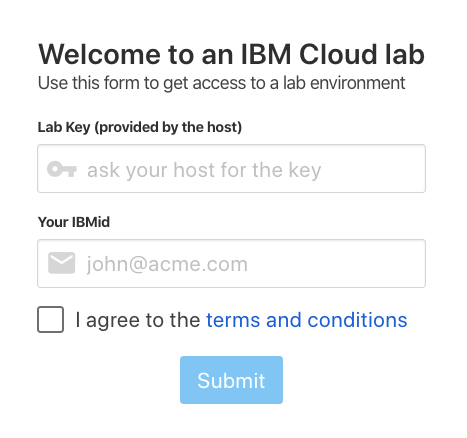

# Pre-work

This section will guide you through the pre-requisites and setup of the environment used in this workshop labs. It is broken up into the following steps:

1. [Sign up for IBM Cloud](#1-sign-up-for-ibm-cloud)
1. [Access a cluster](#2-kubernetes-cluster)

## 1. Sign up for IBM Cloud

You will need an IBM Cloud ID for the workshop. If you already have an IBM Cloud ID, proceed to the next section. To create an ID:

1. Follow the steps outlined in [NEWACCOUNT](NEWACCOUNT.md).

## 2. Kubernetes Cluster

For the hands-on labs, you will be given access to a temporary free kubernetes cluster that was pre-created for the purpose of the workshop. The cluster will be deleted after the workshop. To gain access to this cluster:

1. Open the URL that was provided to you by the instructor to access your cluster.

   

1. Log in to this IBM Cloud account using the workshop code and your IBM Cloud account IBM id.

1. Follow the instructions which ask you to `Log in to this IBM Cloud account`.

   

1. Navigate to Clusters and select the cluster assigned to you.

   

1. Details for your cluster will load. Click on the `Access` menu item in the left navigation column, where you can find instructions to access your cluster from the command line client.

   

1. If you do not have the command line tools installed on your machine, we recommend you use the [IBM Cloud Shell - https://shell.cloud.ibm.com/](https://shell.cloud.ibm.com/). It is attached to your IBMid. It might take a few moments to create the instance and a new session,

   

   > *Note: Ensure the cloud shell is using the same account where your cluster is provisioned. Check that the account name shown in the top right of the screen, next to `Current account` is the correct one.*

1. You should now be read to start with labs.
