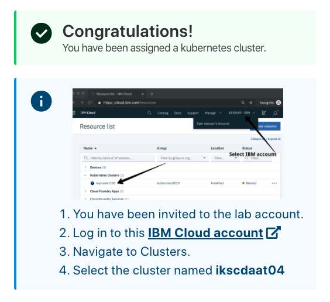
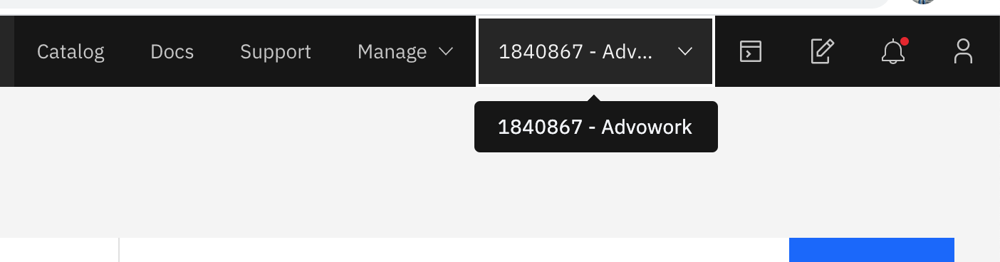
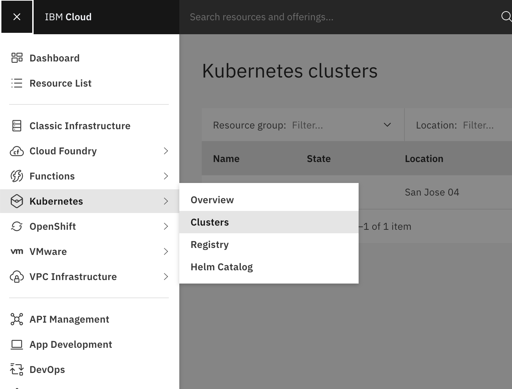
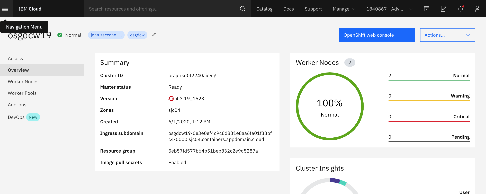
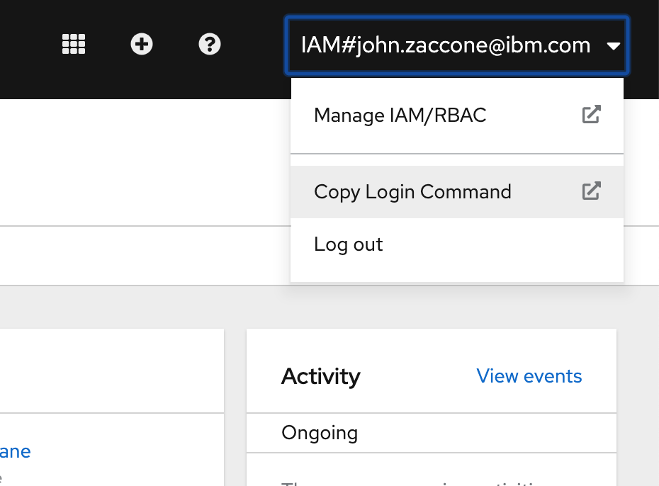

# Tekton Lab 0

This section will guide you through the pre-requisites and setup of the environment used in this workshop labs. It is broken up into the following steps:

1. [Sign up for IBM Cloud](#1-sign-up-for-ibm-cloud)
1. [Access a cluster](#2-kubernetes-cluster)
1. [Log in to OpenShift](#3-log-into-openShift)

## 1. Sign up for IBM Cloud

You will need an IBM Cloud ID for the workshop. If you already have an IBM Cloud ID, proceed to the next section. To create an ID:

* Follow the steps outlined in [NEWACCOUNT](NEWACCOUNT.md).

## 2. OpenShift Cluster

For the hands-on labs, you will be given access to a temporary free OpenShift cluster that was pre-created for the purpose of the workshop. The cluster will be deleted after the workshop. To gain access to this cluster:

* Open the URL that was provided to you by the instructor to access your cluster.


* Enter the workshop code provided by the workshop instructor and your IBM Cloud account IBM id. Select the terms and conditions checkbox and click the **`Submit`** button

* You will be added to a cloud account where a cluster has been pre-provisioned for you. Click on the link in the instructions which ask you to `Log in to this IBM Cloud account`.



* If you previously logged in to the IBM Cloud, the browser will direct you to the IBM Cloud resource list view (if you have not logged in previously, you will be asked to log in using your IBM Cloud ID). Expand the `Clusters` section and select the cluster assigned to you (the name will vary).


* Note the name of your cluster, you will use this cluster for this lab.

## Log into OpenShift

Once you have a cluster, you will need to authenticate with the OpenShift console before continuing.

From the [IBM Cloud Home Page](https://cloud.ibm.com), make sure you are in the IBM Cloud account where your cluster is located. Select from the dropdown menu in the upper right.



Next, find your clusters by navigating to **Kubernetes->Clusters** in the upper lefthand menu



Select your cluster to get to the cluster home page. Then, select the **OpenShift Web Console** Button



From the OpenShift console, in the upper righthand menu, select **Copy Login Command**



Follow the instructions including logging in using your IBM ID to get the command to login. Run the command in your IBM Cloud Shell environment

```console
oc login --token=... --server=...
```