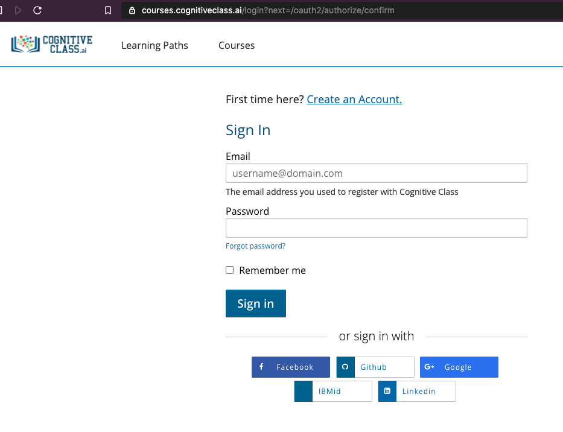
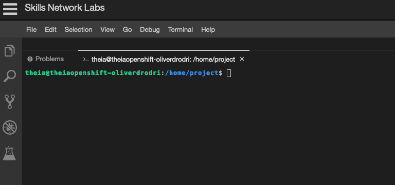

# IBM Skills Network Access

## Access IBM Skills Network

1. If you have registered your account, you can access the lab environment at **https://labs.cognitiveclass.ai/** and go directly to step 6.

1. Navigate to https://labs.cognitiveclass.ai/register,

    

1. Create a new account with a Social login (LinkedIn, Google, Github or Facebook), or click the `Cognitive Class` button,

    

1. Click `Create an Account`,

1. Fill in your Email, Full Name, Public Username and password, click on the check boxes next to the `Privacy Notice` and `Terms of Service` to accept them. Then click on `Create Account`.

1. You will then be taken to a page with a list of sandbox environments. Click on the option for **Theia - Cloud IDE (With OpenShift)**

    

1. Wait a few minutes while your environment is created.

    

1. You will be taken to a blank editor page once your environment is ready.

1.  What we really need is access to the terminal. Click on the `Terminal` tab near the top of the page and select **New Terminal**

    

1.  You can then click and drag the top of the terminal section upwards to make the terminal section bigger.

    

With that done, you can return back to the lab.

<- [Back to the lab](./README.md)