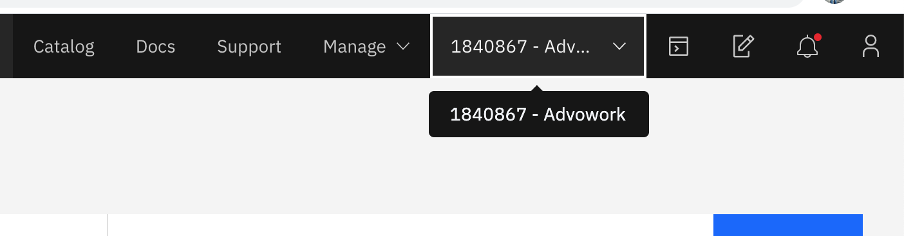
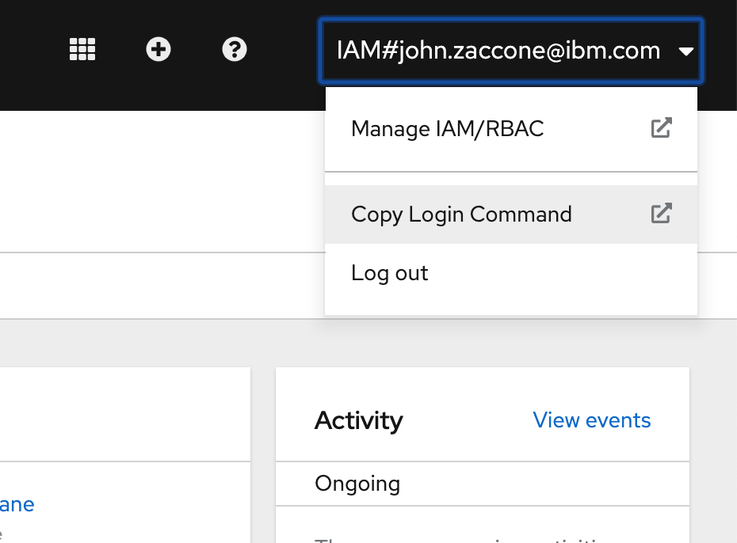

# Helm Lab 0

This section is broken up into the following steps:

1. [Access the Cloud Shell](#1-access-the-cloud-shell)
1. [Log into OpenShift](#2-log-into-openshift)
1. [Install Tekton CLI](#3-install-tekton-cli)

## 1. Access the Cloud Shell

From the [IBM Cloud Home Page](https://cloud.ibm.com), select the terminal icon in the upper lefthand menu.


## 2. Log into OpenShift

Optionally, if you would like to use OpenShift for this lab, then you will need to authenticate with the OpenShift console before continuing.

From the [IBM Cloud Home Page](https://cloud.ibm.com), make sure you are in the IBM Cloud account where your cluster is located. Select from the dropdown menu in the upper right.



Next, find your clusters by navigating to **Kubernetes->Clusters** in the upper lefthand menu


Select your cluster to get to the cluster home page. Then, select the **OpenShift Web Console** Button


From the OpenShift console, in the upper righthand menu, select **Copy Login Command**



Follow the instructions including logging in using your IBM ID to get the command to login. Run the command in your IBM Cloud Shell environment

```console
oc login --token=... --server=...
```

## 3. Install Tekton CLI

Run the commands below to install `tkn` the Tekton CLI that we will be using in this lab

```console
curl -LO https://github.com/tektoncd/cli/releases/download/v0.9.0/tkn_0.9.0_Linux_x86_64.tar.gz
```
```console
mkdir ~/tknbin
```

```console
tar xvzf tkn_0.9.0_Linux_x86_64.tar.gz -C ~/tknbin tkn
```

```console
echo 'export PATH=$HOME/tknbin:$PATH' > .bash_profile
```

```console
source .bash_profile
```

```console
tkn version
```